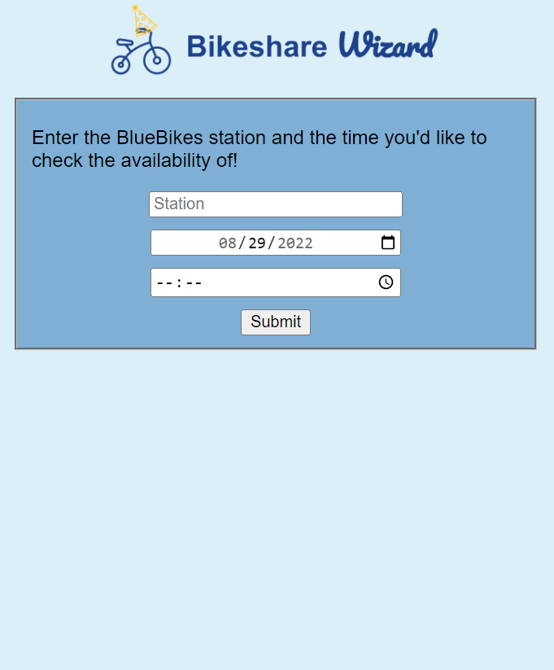
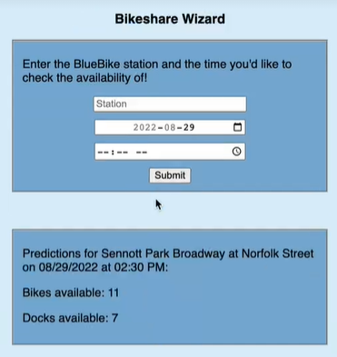

# Bikeshare Wizard

Capstone project by Anna Cheng, Tiffany Cheng, Tina Fang, Giulia Olsson, and Tres Pimentel for UC Berkeley's Master of Information and Data Science program.

For more detailed information, please find the final presentation slides [here](https://github.com/tiffanyyc/capstone_bikeshare/blob/main/presentations/presentation_3_slides.pdf).

## Description

**Bikeshare Wizard forecasts bike and dock availability in 15-minute increments for each of the 450 stations in Boston's Bluebikes bikeshare system. Our mission is to make bikeshare more reliable and to ensure that it remains an attractive, climate-friendly form of transportation.**

Currently, users rely on the real-time station status data provided in the Bluebikes app. From our user interviews, we learned that all users have experienced issues with not finding a bike or dock at a station, and a majority of users said that they would use a bikeshare availability prediction app if it existed. However, we found no existing application or service that provides bikeshare availability forecasts.

To solve this problem and to fill in a void, we developed a product called Bikeshare Wizard. By combining historical trips data from the past 2 years and real-time station status data from Bluebikes, we apply two DeepAR time series models to forecast in 15-minute increments for up to 3 future days.

*Bikeshare: publicly-available bikes that are docked at stations, rented out for a fee, and returned to a station within the same metropolitan area.*

## Impact

Bikeshare Wizard positively impacts bikeshare users and the climate. Users are able to plan their commutes ahead of time, have more reliable and efficient commutes, and a better user experience leads to more users. With more users, there will be less cars on the road. According to [Scientific American](https://www.scientificamerican.com/article/is-bike-sharing-really-climate-friendly/), 1 mile biked (instead of driven) reduces CO2 emissions by 1 pound. In NYC, [Citi Bike](https://w42st.com/post/new-york-pedal-power-why-2021-was-the-year-of-the-citi-bike/) estimated that they saved almost 7,000 tons of CO2 from being emitted in 2021.

## Web Application

Bikeshare Wizard is available through a web application where users enter in the station name, date, and time that they would like a bike or dock availability forecast for.

**App Homepage:**

**Forecasted Availability:**

